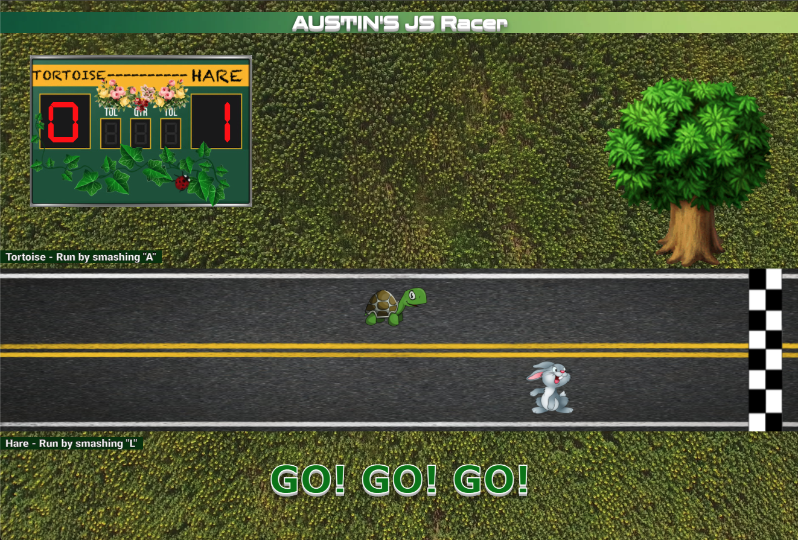

## [Live Demo](https://pages.git.generalassemb.ly/austinschroeder/Austin-JS-Racer/)

Technologies Used:

-HTML
-CSS
-JAVA SCRIPT

Fun racing game using very simple JavaScript/jQuery, HTML, and CSS with no compilers.  I used this app as a great way to up my knowledge of using jQuery.
Best of 3 wins!

